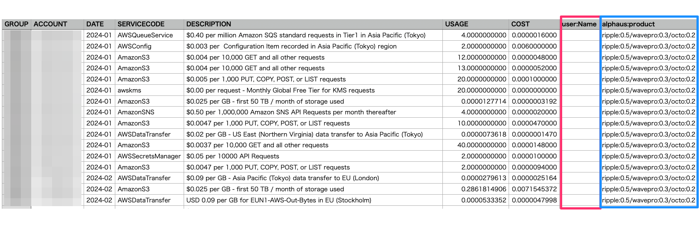

# レポートフィルター

## 事前準備 

本機能はユーザーごとに利用可否があるため、メニューに表示されていない場合はアカウント発行元までお問い合わせください。

## 機能概要 

事前にWave PROアカウントに含まれているアカウントに対して複数の条件を指定し　該当するコストデータをCSV形式でダウンロードする機能です。

コスト分析時に利用することはもちろん、異常値の特定やモニタリングのしたいコストをすぐに確認することが可能です。

CSV形式で出力されるので、BIへの連携や社内経理システムへの連携などカスタマイズしながら自社の利用用途に合わせて利用することもできます。

<figure><figcaption>
レポートフィルター操作画面
</figcaption></figure>

フィルタリングオプション：

* Product code - サービス名
* Region - サービスを利用しているリージョン
* Zone - サービスを利用しているゾーン
* Usage Type - 利用料タイプ
* Instance Type - インスタンスタイプ
* Operation - オペレーション
* Invoice - 請求書ID（Invoice ID）
* Description - サービスの説明（サービス名よりも細かく表示されます）
* Resource - リソース単位

上記のフィルタリングオプションから複数の条件を指定し分析に利用するデータを抽出することが可能です。

## 操作方法 

本機能は保存したフィルターを参照するかたちでCSVをダウンロードします。なので、まずはフィルターの作成から操作をおこないます。

1. Wave PRO にログイン
2. 左メニューの「レポートフィルター」をクリック
3. 右上の縦「・・・」をクリックし「フィルターを作成」をクリック
4. 下記のような画面が表示されるので各設定を入力します（\*値まで選択してから保存してください）
5.  基本的にフィルターを追加すると「AND」形式で指定した条件にマッチするデータをフィルタリングします

    <figure><figcaption></figcaption></figure>
6. 「フィルターを追加」をクリックすると「OR」形式で出力データを増やすことも可能です
7. 各設定の入力を終えたら右下にある「フィルターを保存」をクリックします

後は保存したフィルタを「カスタムフィルター」から選択しデータの範囲（利用月）を決め、CSVダウンロードのアイコンをクリックしCSVで表示されるカラムを選択すればCSVがダウンロードされます。

<figure><figcaption></figcaption></figure>

## タグの選択と表示について 

フィルター指定時にタグを指定する場合の方法について記載しています。

<figure><figcaption></figcaption></figure>

csvに出力したいタグkey / タグvalueをそれぞれ選択します。

複数のタグを出力したい場合は「フィルターを追加」ボタンからひとつずつ追加していきます。

特定のタグkeyに対してある一定条件のValueの値を出力をする場合はRegexが活用できる場合があります。

<figure><figcaption></figcaption></figure>

タイプの種類

* Equals : 条件と等しい値
* Contains : 条件を含む値
* Starts with : 条件から始まる値
* Ends with : 条件で終わる値
* Does Not Equal : 条件と等しくない値
* Does Not Contain : 条件を含まない値

また、タグがついていないリソースを出力する場合は以下のような方法で指定が可能です。

1. タグKeyを指定
2. Regexにチェックを入れる
3. Regex に `re:^\s*$` と記載（この際タイプやValuesの欄は操作不要）
4. \+ New Pair (and) をクリックし 1-3 を全タグKey分で実施

▼例

<figure><figcaption></figcaption></figure>

その他特定のタグKey配下のタグValueがついているコストを全て取得するには以下の方法で指定が可能です。

1. タグKeyを指定
2. Regexにチェックを入れる
3. Regex に `re:[\S\s]+[\S]+` と記載（この際タイプやValuesの欄は操作不要）
4. 保存もしくは他にもタグKeyを指定したい場合は1から3を実施

▼例

<figure><figcaption></figcaption></figure>

### csv出力結果 

特定のタグをフィルターしている場合とそうでない場合で出力結果のフォーマットが異なります。

* フィルター作成時に特定のタグを指定している場合\
  指定したタグのKeyごとに列が分かれます。\
  以下はNameタグとproductタグを指定した場合のcsv出力結果のサンプルです。この場合、ここに表示されているリソースはNameタグ配下のValueが付与されているものはなく、一方でproductタグのValueが付与されているということがわかります。

<figure><figcaption></figcaption></figure>

*   フィルター作成時にはタグを指定せず、出力内容にタグを選択した場合\
    TAGS欄にそのリソースが紐づくタグkey, valueが表示されます。\
    タグが紐づいていないリソースでもTAGS欄には全TAG Keyが表示されます（Valueは空欄）\

    例: `[user:Name: user:AWS: user:Env:prod user:Project:ripple]`

    というTAGS欄の記載がある場合にはその行の利用量はタグkey:Env、タグValue: prodとタグkey: Project、タグValue: rippleというタグが紐づいている状態。

## 仕様上の注意 

1. **稼働時間（Usage）を表示したい場合はダウンロード時にDescriptionにチェックを入れてください。チェックを入れていないとUsageは0で出力されます。**
2. 条件について
   1. AND条件の更に複数指定時は条件がORとなります。
      * （（A、Bリージョン）AND （サービス１、２、３））\
        OR\
        （（A、Bリージョン）AND （サービス８、９）AND （リソースA））
   2. Filter対象を複数指定時のORは前方一致
      *   AmazonS3, AmazonEC2の場合

          AmazonS3Glacier, AmazonS3, AmazonEC2 が含まれます

## その他注意点 

* **タグベースの請求グループでは対応しておりません。**
* **リソースID単位でのデータ出力を利用したい場合はアルファスまでご連絡をいただけますと幸いです。**データ量の関係から提供を制限しております。
* アクセスグループの対応は近日中にリリース予定ですが、2022年6月時点では本機能を利用することができません。
* 抽出するデータ量によってはローディングに時間がかかることがあるので、あらかじめご留意ください。
* フィルタでアカウントの指定をしない場合は全アカウントが対象となります。
